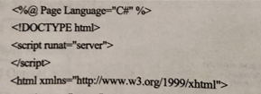
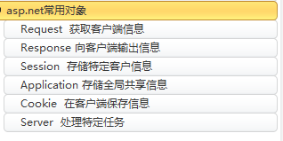

## ASP.net的优点

可以利用整个平台的威力和灵活性

简易性

可管理性

可伸缩性

自定义性和扩展性

安全性

## PHP与JSP区别

**PHP****：**开源,适用于中小型网站开发

**JSP****：**开放性,跨平台，代码分离,但仅对Windows系统有好的兼容效果,维护较难

## ASP.net文件夹的作用,优点和缺点

APP_Data      数据库

APP_Code  	源代码

APP_GlobalResources   全网资源

APP_LocalResources 	 本地资源

APP_Browsers         		标识浏览器

**优点:**方便编译和管理,简单易用

**缺点:**局限与windows平台

## HTML的基本结构，标签的基本写法

### 指令

```html
<%@ Page Language="C#" AutoEventWireup="true" CodeFile="tryForm.aspx.cs" Inherits="_Default" %>
//编程语言为C#,需要链接的服务器代码文件为tryForm.aspx.cs
```

#### ASP.NET页面指令

```asp
@import:      <%@Import namespace="value"%>
//将命名空间导入当前页,使命名空间内所有类和接口可用于该页,导入的命名空间可以是.NET Framework类库 或 用户自定义的命名空间的一部分

@implements:     <%@Implements interface="ValidInterfaceName"%>
//提示当前页或用户控件实现指点的.NET Framework 接口

@reference:     <%@Reference page|acontrol="pathtfile"%>
    
//以声明的方式将页或用户控件链接到当前页或用户控件
```


### 文档类型声明

```html
<!DOCTYPE html>
```

### 代码声明

```html
<script></script>
```

### 服务器代码

```html
<head runat="server">
```

### 文本和XHTML标记

```html
<html>

<body>

...

</body>

</html>
```

## asp.net网页组成

​    可视元素:标记\控件\静态文本  .aspx (前端)

​    页的逻辑编程:事件程序及其他代码 .aspx.cs (后台)


---

## 配置文件中身份验证的模式有哪些

> **Windows**   使用Windows身份验证,适用于域用户或者局域网用户

> **forms**     	使用表单验证,依靠网站开发人员进行身份验证

> **passport**   使用微软提供的身份验证服务进行身份验证

> **none**      	不进行任何身份验证


---

## 目前开发模式的两大主流开发架构

**C/S**    **客户端/服务器   //软件模式,不依赖外部网络环境**

**B/S**    **浏览器/服务器   //可以实现不同人员从不同点,以不同方式,访问和操作共同数据,但对外网依赖性太强**


---

## 超链接标签中的属性，值

**属性:   href =**"URL"

​        **id =**"id"

​        **target**(打开方式) ="_blank"  //新窗口打开

​              ="_parent"  //父(上一层)窗口中打开

​              ="_self"    //本窗口打开

​              ="_top"    //顶级窗口打开

​              ="窗体名称"     //特定窗口打开


---

## 表格

​    rowspan 跨行

​    colspan 跨列


---

## 单文件页面模式的后台代码放哪

       <script > ...</script>标记的模块中

​                               

---

## 用什么获取页面中的传送值

Request对象

---

## session的时间

Timeout默认20分钟

---

## session和cookies的区别

**session:**    存储在服务器,有有效期限

**cookies:**    存储在客户端,可以配置到期失效的规则,不确定性有可能被禁用,简单,有大小限制

---

## Application的方法及其用法

**方法:   Lock       锁定对象以保证同步**

​           **Unlock** **解除锁定**

​           **Add**       **新增一个Application对象变量**

​           **Clear**   **清除全部Application对象变量**

​           **Remove**    **使用变量名移除一个Application对象变量**

​    Application["对象名"]=变量、常量、字符串、表达式

​    Application.Remove("变量名");

​    Application.Lock();

​    Application["对象名"]=值;

​    Application.Unlock();

​       //每次操作数据都要Lock,Unlock

---

## Application和Session如何保存数据

**Application :**   **在服务器端建立一个状态变量存储所需的信息,存储在服务器内存中,一旦服务器重启,则Application中的信息丢失       (保存所有客户的公共信息)**

**Session :**   **在状态服务器中单独存储Session对象的内容,一般不会丢失   (记载特定用户的信息,存储跨页程序的变量或对象)**

---

## ASP.NET出现乱码如何转换

Server.HTMLDecode();

---

## 输出/跳转

**①Response.Redirect("url"); 引导客户端浏览器至新web页面**

**②<a href="url" target id="">xxx</a>**

**③<script>alert('这是运行在script输出在弹出框中的脚本');</script>**

---

## Borwser属性的值分别有哪些，可以用什么来接收

​    **属性值:  Browser    浏览器类型名称**

​           **Version**    **浏览器版本名称**

​           **MajorVersion**   **浏览器主版本**

​           **MinorVersion**   **浏览器次版本**

​           **Frams**     **是否支持框架功能**

​           **Tables**     **是否支持表格功能**

​           **Cookies**    **是否支持cookies**

​           **VBScript**   **是否支持VBScript**

​           **JavaApplits**    **是否支持Java小程序**

​           **ActiveXControls**    **是否支持ActiveX控件**

​    **用Request接收**

---

## 浏览器型号版本名称

Request.Browser["all"].ToString()

---

## session

结合Global.asax文件使用

​    **属性:   SessionID      只读的唯一属性**

​           **IsNewSession**  **是否创建新会话**

​           **Timeout   Session****有效时长,默认为20min**

​           Session.Timeout=60;

​           **Keys**          **根据索引号获取变量值**

​           **Count**      **获取会话状态中的项数**

​    **方法:   Abandon      清除Session对象**

​           **Add**           **创建Session对象**

​           Session["变量名"]=值;

​           //强制转换数据类型

​           Application["online"]=(int) Application["online"]+1;

​           **Clear**      **清除所有Session对象变量,但不结束会话**

---

# asp.net常用对象

## 内置对象的作用

 

## Request      获取客户端信息

​    **属性:   QueryString    获取查询字符串集合**

​           Response.write(Request.QueryString["变量名"].ToString());

​           **Path**          **获取当前请求的虚拟路径**

​           Response.write(Request.Path.ToString());

​           **Browser**        **获取和注释客户端浏览器的兼容信息**

​           Response.write(Request.Browser["Browser"].ToString());

​           **UserHostAddress**  **客户端IP地址**

​           **...**

​           **ServerVariables**    **获取服务器变量集合**

​           Response.write(Request.ServerVariables["ALL_HTTP"].ToString());

​           **ClientCertificate**    **获取****客户端 HTML 页中的客户端证书设置**

​           **...**


## Response 向客户端输出信息   

​    执行system.web命名空间中的httptResponse类

​    **方法:   Write      输出信息**

​           输出二维数组

​           char[,]  数组名{{'',''},{'',''},...,{'',''}};

​           Respone.write(数组名,下标,array.length);

​           **Redirect**    **引导客户端浏览器至新web页面**

​           Respones.Redirect("url");

​           **WriteFile**   **输出文件**

​           **①**Respones.ContentType="文件类型";

​           Respone.WriteFile("文件名")

​           ②Respone.WriteFile(@"E:\...\文件名.txt")  //非本文件区

​           **End**        **将缓冲区数据输出到客户端,然后停止页面程序执行**

​           **Flush**      **输出缓冲区数据,但不停止页面程序执行**

​           **Clear**      **清除缓冲区数据**

​    **属性    BufferOutput  设置Respond对象的信息输出是否支持缓存处理**

​                         **值为true或false,默认为true**

​           **ContentType**   **指定输出文件的类型**


## Session   存储特定客户信息

结合Global.asax文件使用

​    **属性:   SessionID      只读的唯一属性**

​           **IsNewSession**  **是否创建新会话**

​           **Timeout   Session****有效时长,默认为20min**

​           Session.Timeout=60;

​           **Keys**          **根据索引号获取变量值**

​           **Count**      **获取会话状态中的项数**

​    **方法:   Abandon      清除Session对象**

​           **Add**           **创建Session对象**

​           Session["变量名"]=值;

​           //强制转换数据类型

​           Application["online"]=(int) Application["online"]+1;

​           **Clear**      **清除所有Session对象变量,但不结束会话**


# 第一个asp代码

```asp
var str="I am a student";
Response.write("使用Response输出结果："+str);

<p>使用标签输出结果：Hello world！</p>


Respones.Redirect("welcome.aspx");


Respone.write("欢迎进入ASP.NET学习世界！<br/>").Tostring();

label2.text=Request.Browser["Browser"].ToString();
label3.text=Request.Browser["Version"].ToString();


<input type="text/radio/date/email/color/range/url/submit/checkbox" size min max checked="checked
	autofocus="autofocus" required="required" />

///Login
if(TextBox1.text=="mr"&&TextBox2.Text=="123")
{
	Session["UserName"]=TextBox1.text;
	Session["LoginTime"]=DataTime.Now;
	Respones.Redirect("welcome.aspx");
}
else
	respone.write("<script>alert('登录失败')；location='Login.aspx'</script>")
///welcome
{
Response.write("欢迎用户"+session["UserName"].Tostring()+"登录本系统\n");
Response.write("登录时间"+session["LoginTime"].Tostring());
}
respone.write("<script>alert('登录失败')；location='Login.aspx'</script>")
```

