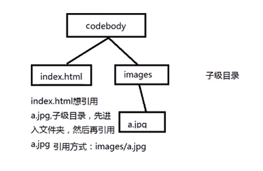
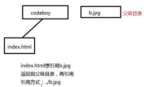

# HTML :

> hypertext markup language 超文本标记语言
>
> markup:标记/标签 即超文本组成形式

## 标记语法

​	标记/元素,在网页中主要表示影响功能,使用时必须用<>括起来

### 类型

#### 		1、封闭类型

​			双表记，必须成对出现，有始有终
```html
	<标记>内容</标记>
```
#### 		2、非封闭类型

​			单标记，只有一个标记组成，既表开始也表结束
```html
<标记/>
```
### 嵌套
```html
	<标记1>
		<标记2>
			<标记3/>
		</标记2>
	</标记1> 
```
### 属性

​	作用：

> 修饰元素/标记

​	语法：

> <标记 属性="值" 属性="值"...></标记>

​	标准属性(所有元素都支持的属性):

> ​		  id 		定义元素的唯一标识(名称)
> ​		  title 	定义鼠标移到元素上时所提示的文字
> ​		  class 	定义元素引用类选择器(CSS中)
> ​		  style 	定义元素行内样式(CSS中)
> <!-- 注释 1、不能嵌套;2、不能写在标记内 -->

​	align 取值：

> ​		left 居左 
> ​		center 居中
> ​		right 居右

### 文本标记

#### 1.特殊字符
```html
	&nbsp  		表一个空格
	&lt &gt  	表示  小于符  大于符
	&copy 		表示版权
	&yen		￥
```
#### 2.文本样式
```html
	<b></b>	加粗
	<i></i> 	斜体
	<u></u>	下划线
	<s></s>	删除线
	<sup></sup>	上标
	<sub></sub>	下标
```
#### 3.标题元素
```html
	<hn></hn>	n:1~6   1~6级标题样式
```
#### 4.段落元素
```html
	<p> </p>
```
#### 5.换行元素
```html
	</br>
```
#### 6.水平线元素
```html
	<hr> 
```
#### 7.预格式文本

```html
	<pre></pre>
```
#### 8.分区元素

##### 块分区

> 用于页面做布局效果

```html
<div> 内容 </div>
```

##### 行分区

> 处理同一文本的不同样式

```html
<span> 内容 </span>
```

区别

> ​	块级元素:在网页中独占一行的元素
> ​		例:	标题、段落、div
> ​	行内元素：在网页中，多个元素位于同一行
> ​		例：b、i、u、s、sup、sub
> ​	行内块元素： 表单控件

 

### 图像

#### 格式

jpg：压缩比率大，图片模糊
gif: 动画
png：背景透明（常用于logo）

#### 元素

```html
	
属性：	  src：要显示图像的url
		alt : 说明文字，图片未加载时显示的文字
		title ：鼠标移入时显示的文字
		height、width ：改动其中一项，另一项会等比缩放
```

### 路径

> url(Uniform Resource Loctor) 统一资源定位器

#### 表现形式

##### 1、绝对路径

​	**本地资源**
​		例：C:\Users\QAQ\Pictures\BnS\1.jpg
​	**网络资源**
​		例：http://cdn.tmooc.cn/bsfile//courseImg///F9C472925075421CB8D5F9940ADCC5D2.png

##### 2、相对路径

​	从当前文件所在的位置开始查找资源所经过的路径

> ​		同级目录 （直接引用）
> ​		子级目录
> ​	 
>
> ​		父级目录
>
> 

##### 3、根相对路径

​	永远从服务器所在的根目录处开始查找
​		/codeboy/images/a.jpg
 

### 超链接

```html
<a> </a>
```

#### 	属性：

```html
href ：链接路径（url）
target ：打开方式
		_blank:在新的窗口中打开
		_parent:在上一层窗口中打开
		_self:在本浏览器窗口中打开 (默认)
		"窗体名称": 在指定窗口中打开
```

#### 	表现形式

​	1、资源下载
​	 让链接的url，链接到rar/zip文件即可

```html
<a href="3DMGAME-NieRAutomatav1.02T5.rar">下载</a>
```

​	2、电子邮件链接

```html
<a href="mailto:1459694320@qq.com">打开邮箱</a>
```

​	3、返回顶部

```html
<a href="#" >返回顶部</a>
```

#### 	锚点

> 网页中的一个记号，可以通过超链接跳转到改记号的位置处

##### 使用方式

​	**定义锚点**
​		1、使用a标记的name属性定义锚点

```html
<a name="锚点名称"></a>
```

​		2、使用任意标记的id属性定义锚点

```html
<any id="锚点名称"></any>
```

​	**链接到锚点**
​		1、本页面锚点

```html
<a href="#锚点名称" >本页面</a>
```

​		2、其他页面锚点

```html
<a href="url#锚点名称" >其他页面</a>
```

### 表格

#### 	定义

```html
表格: <table></table>
行:	<tr></<tr>	//table row
单元格:<td></td>  //table data
```

#### 	属性

```html
#table
		width 	宽度
		height 	高度
		align 	水平对齐方式(left/center/right)
		border 	边框宽度
		cellpadding	设置单元格内边距 (内容与td边框之间的间距)
		cellspacing 设置单元格外边距 (td边框外的间距)
		backcolor 	背景颜色
#tr
		align 		设置当前行内容的水平对齐方式(left/center/right)
		valign		设置当前行内容垂直对齐方式(top/middle/bottom)
		backcolor 	设置当前一行的背景颜色
#td
		...
		rowspan		跨行
		colspan		跨列
```

#### 可选标记

##### 		表格标题	

```html
<caption></caption>	//如果设置,必须位于<table>下的第一个子元素
```

##### 		行/列标题 	

```html
<th></th>	//所有td都可以被th取代
```

##### 		行分组

​		可以将连续的几个行,划分到一个组中进行统一的管理
​	**1.表头行**		

```html
<thead></thead>
```
​			表格中最上面一行
​	**2.表主体行**	

```html
<tbody></tbody>
```
​			允许将若干行放在tbody中进行统一管理
​	**3.表尾行**		

```html
<tfoot></tfoot>
```
​			表格中的最后一行
 

### 列表

#### 	作用

> ​	按照从上到下(从左到右) 的方式来显示所有的数据,并且可以在数据前增加显示的标识

#### 	组成

​	由"列表类型"和"列表项"来组成
​		1.列表类型
​		有序列表: 
```html
 <ol></ol>  		//order list
```
​		无序列表:  
```html
<ul></ul>		//unorder list
```
​		2.列表项
​		用于表示列表中的数据(嵌套在列表类型中)
```html
<li></li>  //list item
```
#### 	属性

##### 有序列表
​	**type**

> 作用:指定列表标识的类型

> 取值: 
> 	upper-alpha		A大写英文
> 	lower-alpha		a小写英文
> 	upper-roman	Ⅰ大写罗马数字
> 	lower-roman 	ⅰ小写罗马数字
> 	decimal				1十进制数字
> 	start
> 		作用:指定起始编号从第几开始

##### 	无序列表

> type取值:
> 			disc		实心圆
> 			circle		空心圆
> 			square		实心方块
> 			none		无

#### 	定义列表

> 常用于给出一类事物的定义或对名词的解释说明等

```html
	<dl>  			//表示一个定义列表
		<dt>			//定义列表中要解释的名词
			《西游记》
		</dt>    
		<dd>		//表示定义列表中对名词解释的内容
			《西游记》是四大名著之一
		</dd>   
	</dl>
```

#### 结构标记

> 用于描述整个网页的结构（取代div做结构布局）

```html
常用结构标记：
1.<header></header>
	作用：定义网页或某部分的头部 
2.<nav></nav>
	作用：定义网页的导航链接
3.<section></section>
	作用：定义网页的主体内容
4.<aside></aside>
	作用：定义页面中的侧边栏
5.<footer></footer>
	作用：定义页面靠底部的信息
6.<article></article>
	作用：定义与文字描述相关的内容，如：论坛中的帖子、微博、用户评论等。
```

 

## 表单(重点)

​	作用：

> 1.提供可以与用户交互的可视化控件
> 2.收集用户信息并提交给服务器、

​	组成部分

> 1.前端部分
> 	表单元素，于用户交互的可视化控件（文本框、密码框、按钮...）
> 2.服务端部分
> 	对提交的数据处理，***.php

### 	表单元素

​	标记：

```html
	<form></form>
```

​	属性：

```html
1. action 
	 --指定处理表单数据的程序文件所在位置
2. method	
	 --指定表单数据的提交方式
	取值:
	1. get (默认值)
		1 明文提交,待提交的数据会显示在地址栏上
		2 安全性低
		3 提交数据又大小限制 2kb
		4 向服务器要数据时,使用get方式
	2.post
		1 隐式提交,提交的数据不会显示在地址栏上
		2 安全性较高
		3 提交数据无大小限制
		4 要传递数据给服务器处理时,使用post方式 
	3.delete 删除
	4.put	...
3. enctype
	作用:指定表单数据的编码格式,允许将什么样的数据提交给服务器
	取值:
	1.application/x-www-form-urlencoded
		默认值,允许将任意字符提交给服务器(文件无法提交)
	2.multipart/form-data
		允许将文件提交给服务器  //当提交文件时,必须将提交方式改为post
	3.text/plain
		只能将普通字符提交给服务器

```

### 控件

​       能够与用户进行交互的可视化控件

####    1.分类

##### 1.input元素

> ​    **作用:**在页面中提供各种各样的输入控件,如:文本框,密码框,单选按钮,复选框...

######    语法:

​      **标记: <input></input>**

​      **属性:**  

​			1.**type** 指定创建输入控件的类型

​            2.**name** 为控件定义名称,服务器端使用 (必须)

​            3.**value**  控制的值,给用户看的提示信息

​            4.**disabled** 禁用控制,不能操作并且也不能提交 (该属性无值,只要出现在标记中就是禁用)

###### 1.文本框和密码框

​     **文本框:** 
```html
<input type="text">
```

​     **密码框:** 
```html
<input type="password">
```

​     **属性:**

​       1.**maxlength**        指定限制输入的字符数

​       2.**readonly**      (无值)只读,无法更改,但允许提交给服务器

​       3.**placeholder**       占位符,既默认显示在控件上的文本

###### 2.按钮

​     **提交按钮: **
```html
<input type="submit">
```

​       功能: 将表单中的数据,提交给服务器上指定的程序(action="**.php")

​     **重置按钮: **

```html
<input type="reset">
```

​     **普通按钮:** 

```html
<input type="button">
```

###### 3.单选按钮和复选框

单选按钮: 

```html
<input type="radio">
```

复选框:

```html
 <input type="checkbox">
```

​		属性:
​			1.name 	 	除定义控件名称外,还起分组作用,同组必须同名
​			2.checked	设置默认被选中项(无值)

###### 4.隐藏域和文件选项框

​	 隐藏域: 

```html
<input type="hidden">
```

​	想要提交给服务器,但不想展示给用户看的数据可以放在隐藏域中
​	

​	 文件选项框:

```html
<input type="file">
```

​		注意: method 属性的值必须为post
​			 enctype 的值必须为 multipart/form-data

---

##### 2.textarea 多行文本域元素

​	 作用:允许录入多行数据的文本框
​	 语法: 

```html
<textarea></textarea>	
```

​	 属性:
​		1.name 	定义控件名称,提供给服务器使用
​		2.cols	指定文本域的列数,即一行能显示多少给英文字符(中文减半)
​		3.rows	指定文本域的行数,即默认显示多少行的数据,超出范围则出现滚动条

##### 3.select和option选项框元素

 	 语法:

```html
	<select>	作用:在页面中表示一个选项框
	 <option>	作用:选项框中的选项
	 </option>
	</select>
```
​	 属性:
​		1.select 
​		  name 定义选项框的名称
​		  size	定义显示选项的数量,默认值为1,若值大于1,元素表示为滚动列表,否则为下拉列表
​		  multiple	设置多选(无值),只有滚动列表支持多选
​		2.option
​		  value 定义选项的值
​		  selected 设置为被选中(无值)

##### 4.其他元素

######   1.label 元素

​	作用:关联文本与表单控件
​	语法: 

```html
<label></label>
```

​	属性:
​		for 用for关联表单控件的id值,用于选中表单的控件

######   2.为控件分组

​	语法: 

```html
<fieldset></ fieldset >		为控件分组
 <legend></ legend >		为分组指定标题
```

######   3.浮动框架

​	作用:允许在一个网页中,再引入另外一个网页
​	语法:

```html
<iframe></ iframe >
```

​	属性:
​		src	要引入网页的url网址
​		width	宽度
​		height	高度
​		frameborder	浮动框架的边框宽度 默认为1

---

#### 新表单控件

​	在HTML5中新提出的控件

##### 1.电子邮件类型

​	作用: 表单提交时,会验证数据是否符合Email的规范(@)
​	语法: 
```html
<input type="email">
```
##### 2.搜索类型

​	作用: 提供了快速清除功能
​	语法:  
```html
<input type="search">
```
##### 3.URL类型

​	作用: 提交时,验证数据是否符合url的规范(绝对路径的规范)
​	语法:
```html
<input type="url">
```
##### 4.电话号码类型

​	作用: 只能在移动端设备中,显示效果为"拨号键盘"
​	语法:
```html
<input type="tel">
```
##### 5.数字类型

​	作用: 只能接收数字,并可以灵活调整数字的值
​	语法:
```html
<input type="number">
```
​	属性:	value 	//控件值
​			min		//能够接受的最小数字值
​			max		//能够接受的最大数字值
​			step		//每次调整数字时数字变化的范围(步长)

##### 6.范围类型

​	作用: 提供一个滑块组件,允许用户选取指定范围的值
​	语法:  
```html
<input type="range">
```
​	属性:		min		//范围最小值
​					max		//范围最大值
​					step		//范围步长
​					value	  //初始值

##### 7.颜色类型

​	作用: 提供一个颜色的拾取控件
​	语法:  
```html
<input type="color">
```
##### 8.日期类型

​	作用: 选择时间日期
​	语法:	
```html
<input type="date">		//选取日期
<input type="week">		//选取周
<input type="month">	//选取月
```