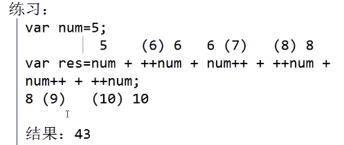
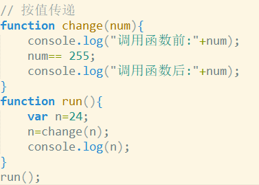
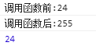
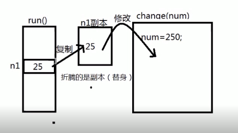

# JavaScript

## 什么是JavaScript?

> JavaScript	简称js,是运行在js解释器/引擎中的脚本语言

### 浏览器内核

​    **负责页面内容的渲染,由两部分组成**

​    1.内容排版引擎	解析HTML/CSS

​    2.脚本结束引擎	解析JavaScript(v8)

### 搭建运行环境

####     1.独立安装js解释器-nodeJS

​       在命令行界面输入node后使用

####     2.浏览器内核中嵌入的js解释器(F12)

#####        1.直接在console中输入

#####        2.将js脚本嵌入到HTML页面中执行

######            ①通过HTML元素的事件执行js脚本

```html
<button onclick="函数"></button>
```

######            ②在==<script>==中编写脚本并执行

​               在网页任意位置嵌入

```html
  <script>脚本</script>
```

######            ③使用外部脚本文件(**.js)编写脚本

​              创建脚本文件并在文件中编写脚本

​              在使用的网页中引入js文件

```html
 <script src="JS url"></script>
```


## JavaScript基础语法

### 运行环境:

​    1.独立安装的js解释器(node)

​    2.嵌入在浏览器内核中的js解释器

### **js发展史**

> 1992年Nombas公司为自己的软件开发了一款脚本语言ScriptEase
>
> 1995年Netscape(网景)开发了脚本语言livescript-JavaScript(与Java没有任何关系)
>
> 1996年micriosoft(克隆版本JavaScript)
>
> 1997年JavaScript提交ECMA,定义为ECMAScript(ES5,ES6)

### 组成部分

​    完整的JS由三部分组成:

​       1.核心(ECMAScript)

​       2.DOM(document object model)	文档对象模型提供一些允许操作页面元素的函数和属性

​       3.BOM(browser object model)	浏览器对象模型提供了一些允许操作浏览器的函数和属性

### 特点

​    1.语法类似于c,java,php

​    2.无需编译,由js解释器直接运行

​    3.弱类型语言(一般不用输入数据类型)

​    4.面向对象的

### 通用语法规范

####    语句

​    1.可以执行的最小单元

​    2.必须以 ; 结束

​    3.严格区分大小写

​    4.所有符号必须是英文

####    注释 

​    ① // 单行注释

​    ② /* 多行注释 */

### 变量和常量

#### 1.声量声明

​    声明变量

​       var 变量名;

​    为变量赋值

​       变量名=值;

​    声明变量并赋值

​       var 变量名=值;

**注意:**

> 1.声明变量时可以不使用var,但不推荐
>
> 2.如果声明变量,但未赋值,则默认值为undefined
>
> 3.允许在一条语句中声明多个变量,用逗号隔开
>
> ​       var name="XXX",uage=16;

#### 2.变量名的命名规范

​    1.不允许使用JS的关键词和保留关键字

​    2.允许包含字母,数字,下划线(_),$

​    3.不能以数字开头

​    4.最好见名知意

​    5.尽量使用"小驼峰命名法"    // userName

​           --"大驼峰命名法"    // UserName

#### 3.变量的使用

​    1.声明变量未赋值,值默认为undefiined

​    2.使用未声明的变量,则会报错

​    3.赋值操作->set操作

​       变量名出现在=的左边,一律是赋值操作

​    4.取值操作->get操作

​       变量名只要没出现在=的左边,一律是取值操作

​       保留x位小数输出       变量名=变量名.toFixed(x);

### JS的三种输出方式

```javascript
  console.log("这是运行在script输出在console中的脚本");

  document.write("这是运行在script输出在页面中的脚本");

 弹出框  

  alert('这是运行在script输出在弹出框中的脚本'); //警告框

  prompt("这是弹出框中的输入框");     //输入框
```


### 数据类型

#### 1.作用

​    规定了数据在内存中所占的空间

#### 2.详解

​    1.原始类型(基本类型)

​       number类型

​       string类型

​       Boolean类型

​    2.引用类型

#### 3.输出

​    将汉字以十进制输出:   

```javascript
"李".charCodeAt();
```

​    将汉字以十六进制输出:    
```javascript
"李".charCodeAt.toString(16);
```

​    将Unicode码转换为汉字: 
```javascript
var str"\u6768";
console.log(str);
```
​    汉字的Unicode码范围:   "\u4e00"~"\u9fa5"

​    特殊字符需要用转义字符:

```javascript
\n 		换行
\t 		制表符（缩进）Tab
\" 		"
\' 		'
\\ 		\
\b		退格
\r		换行
\f		换页
```

#### 4.数据类型转换

#####    隐式转换

​    1.数字+字符串:数字转为字符串

```javascript
var num=15;
var str="hello";
var result=num+str;
 //15hello
```

​    2.数字+布尔:	将布尔转换为数字,true=1 false=0

​    3.字符串+布尔:	将布尔转化为字符串, true / false

​    4.布尔+布尔:	将布尔转换为数字

#### 5.检查变量的数据类型

​    typeof()函数

​    用法:

```javascript
console.log(typeof(变量名));
```

#### 6.强制转换

#####    1.toString()

​    将任意类型转换为字符串
```javascript
var res=变量.toString();
```
#####    2.parseInt();

​    将任意类型的数据转换为整数

​    转换不成功,结果为:NaN(Not a Number)
```javascript
var num=parserInt(数据);
```
#####    3.parseFloat();

​    将任意类型数据转换为小数

​    如果转换不成功,结果为NaN
```javascript
var res=parseFloat(数据);
```
#####    4.Number();

​    将任意类型数据转换为number类型

​    如果包含非法字符,则返回NaN
```javascript
var res=Number(数据);
```
### 运算符

####    算术运算符:  + -  *  /  % ++  -- 

​     ++ -- 在前:先增再运算

​     ++ -- 在后:先运算再增



####    关系运算符(比较运算符)

```javascript
    \>、<、>=、<=、==、!=、===、!==
```

运算结果为：Boolean类型（true 、false）

​    1.关系运算符两端,只要有一个是number类型,另一个会隐式转换为number,再进行比较

​    2.字符和字符的比较,比较Unicode码

​    3.NaN与任何一个数据比较运算时,结果均为false

####    isNaN()函数

​       语法:isNaN(数据);

​        作用:判断指定数据是否为非数字,如果不是数字,返回值为true,

​    是数字则返回值为false

####    逻辑运算符 &&  ||  !

##### 	短路逻辑&&:

​    当第一个条件为false时,整体表达式结果为false,不需进行后续判断

##### 	短路逻辑||:

​    当第一个条件为true时,整体表达式结果为true,不需进行后续判断

####    位运算符   <<  >>  &   |    ^

<< : 右移把数变小

\>> : 左移把数变大

&  : 按位与, 判断奇偶性

​        将任意数字与1做按位与,结果为1,则为奇数;结果为0,则为偶数

|   : 按位或, 对小数取整

​        将任意数字与0做按位或,结果则取整数部分

^   : 按位异或, 用于交换两个数字

####    赋值运算符和扩展运算符

+=   -=     *=     /=     %=     ^= .....

####    条件(三目)运算符

​    单目(一元)运算符：只需要一个操作数或表达式

> ​      ++ ，-- ， ！

​    双目(二元)运算符：需要两个操作数或表达式

> ​      \+ , - , * , / , % ......

​    三目(三元)运算符：需要三个操作数或表达式

> ​      条件表达式 ? 表达式1 : 表达式2
>
> 先判断条件表达式的值,
>
>  如果条件为true,则执行表达式1的操作;
>
>  如果条件为false,则执行表达式2的操作.

### 函数

#### 什么是函数?

​    函数(function),也称方法(method)

​    函数是一段预定义好,并可以反复执行的代码块

​       预定义:提前定义好,并非马上执行

​       代码块:可以包含多条可执行的语句

​       反复执行:允许被多次调用

#### 使用过的函数
```javascript
parseInt();
parseFloat();
Number();
console.log();
alert();
document.write();
```
#### 定义和使用函数

##### 1.普通函数的声明和调用(无参无返回值)

###### 1.声明
```javascript
function 函数名(){
  //函数体-若干条可执行的语句
 }
```
###### 2.函数调用

在任意JavaScript合法的位置处通过 函数名(); 对函数进行调用
```javascript
sayHello();
```
在函数中调用函数
```javascript
function 函数名(){
	sayHello();
	函数2();
 }
```
在控件中调用函数“

​    例: 
```html
<input type="button" name="" value="测试" onclick="sayhello()">
```
##### 2.带参数函数的声明和调用

###### 1.声明
```javascript
 function 函数名(参数名列表){
       //函数体
}
```
​    参数列表: 

​       可以声明1或多个参数,多个参数之间使用逗号隔开即可.

​        声明函数时,声明的参数,称为形参.

###### 2.函数调用

​    函数名(参数值列表);

​    实际使用的参数值,称为实参

​    

##### 3.带返回值的函数的声明和调用

###### 1.声明
```javascript
function 函数名 (参数列表){
       //函数体
      return 值;  //注意:最多只能返回一个值
    }
```
###### 2.调用

​    允许使用一个变量接受函数的返回值

​    var result =函数名(参数值列表);

 

#### 函数的作用域

##### 什么是作用域

作用域表示的是变量或函数的可访问范围

​    js中的作用域,分两种:

​       1.函数作用域: 只在某函数范围内有效

​       2.全局作用域: 代码的任何位置都有效

##### 函数作用域中的变量

​    又称为局部变量,只有在声明的函数中有作用

​    ex:
```javascript
function ex(){
  var 变量名;  //局部变量
 }
```
##### 全局作用域变量

​    又称为全局变量,一经声明,任何位置都能够使用

​       ex:

```javascript
var 变量名;  //全局变量
function ex(){}
```

​       1.不在function中声明的变量,为全局变量

​       2.不使用var关键字声明全局变量,无论任何位置声明,都能全局使用(不推荐)

注意: 当局部变量与全局变量相冲突时,优先使用局部变量;

##### 声明提前

###### 变量声明提前

​    js程序在正式执行前,function声明的函数,会将所有var声明的变量,都预读(预先声明)到所有作用域的顶部,但赋值保留在原位

###### 函数声明提前

​    若在声明的函数前使用了函数,则同样可以调用函数

##### 按值传递

###### 什么是按值传递

​    基本数据类型的数据(number,string,boolean...),在做参数时,都是按照"值传递"的方式进行传参.

​    值传递:真正传递参数时,实际传递的是值的副本(复制出来的一个值),而不是原始值.

详解, 

   



​    修改的是副本,本身不改变

 