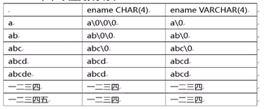

# 数据类型

## 数值类型

###   整数数值类型：

**Tinyint** 

>微整型，占1字节Byte，-128~127 

**Smallint** 

> 小整型，占2字节，-32768~32767 ($-2^{15}$ ~ $2^{15}-1$)

**Int** 

>整型，占4字节，-2147483648~2147483647  ($-2^{31}$ ~$2^{31}-1$)

**Bigint**  

>大整型，占8字节，($-2^{63}$~$2^{63}-1$)

###   小数数值类型（精确数值型）：

**Float(M,D)：**

> 单精度浮点型，占4字节, 3.4E38 (3.4 x $10^{38}$) ,计算时可能产生四舍五入

**Double(M,D):**

> 双精度浮点型，占8字节,1.8E308 (1.8 x  $10^{308}$) ,计算时可能产生四舍五入

**Decimal(M,D)：**

> 定点小数,不会产生精度舍入，适合高精度运算
>    		M—总位数		D—小数点后有几位

### 布尔数值类型（真假类型）：

  **BOOL ：**

> 只能取值ture=>1或 false=>0  -- SQL server中为bit

## 日期时间型：

### **Datetime :** 

> 日期/时间类型，‘2017-10-14 22:10:33’

### **Date :** 

> 日期类型，‘2017-05-14’

### **Time :**

> 时间类型，‘12:44:18’

### 计算机如何存储时间日期：

> 用一个很大的数字，表示目标日期距离“计算机元年（1970-1-1 0:0:0 GMT）”经过了多少毫秒

### 日期时间存储方式：

#### 1、varchar存储：

> 不便于比较大小，格式不灵活

#### 2、date/time/datetime存储：

> 不便于国际化，不同编程语言支持程度不同

#### 3、bigint存储：

> 存储表示距离计算机元年的毫秒值，任何编程语言都可以把其数值转化为日期时间
> 		数字 <=> 时间日期
>
> 

## 字符串型：

### ASCII字符型：

```mysql
char(n)  	定长字符串    
#固定长度n，不足n时自动补齐，n<255,比varchar操作速度快（数据长度固定时使用）

Varchar(n)  变长字符串  
#输入多少存储多少,超过n则截断后存储,n<65535,比char省空间（数据长度变化大时使用）

Text(n)    大型字符串   
#超过8kb的ASCII数据,n<2GB
```

(‘\0’表示结束)

### Unicode字符型（国际标准）：

```mysql
nchar(n)、nvarchar(n)、ntext
#手机号和密码都是字符串型
```

## 货币型：money

## 二进制型：image


