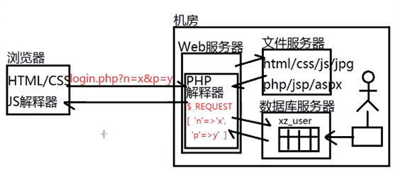

# web服务器概述

​    web服务器用于监听客户端的http或https请求,通常用于处理用户提交的数据或向客户端返回请求的资源

## web服务器分两种:

### (1)**静态web服务器** : 提供的内容是不变的

   **内容 : **

> **HTML/CSS/JS/Flash/GIF/音视频...**

   常见的静态web服务器: 

> **Apache Httpd 、Microsoft IIS 、NginX** 

### (2)**动态web服务器** : 提供的内容,不同人不同时间访问都可能变化

   **内容 :**

> **JSP=HTML+JAVA** （静态web服务器+Java解释器） **PHP=HTML+PHP** **（**静态web服务器+PHP解释器）**ASP.NET=HTML+C#** （MS IIS+C#解释器） **Node.js=HTML+Node**

