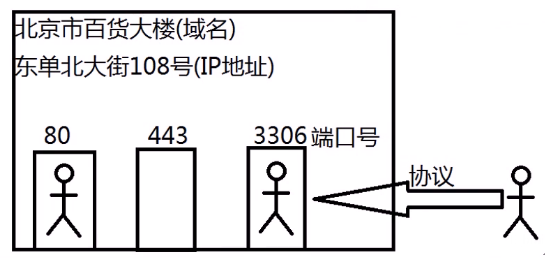
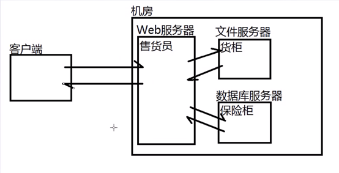
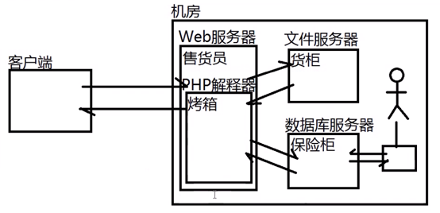
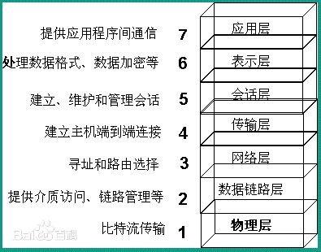

# 项目开发

## **代码要求:** 

有效性、可靠性、可维护性、可重用性、可移植性、可追踪性·

 

## **软件工程:**

1、软件过程

2、软件测试

3、软件度量

4、软件质量保证

5、软件标准

​           

 

## 软件的生命周期/软件过程：

###  **1**、软件定义期

​    (1)可行性研究阶段 —— 《可行性研究报告》/《项目开发计划》

​       技术、人力、设备、时间、资金、回报、政策

​    (2)需求分析阶段 —— 《软件需求规约/说明书》

​       功能性需求、非功能性需求

###  **2**、软件开发期  

​    (3)概要设计阶段 —— 架构师《概要设计说明书》、《数据库设计说明》

​       子系统、模块、各自的功能、模块间接口

   (4)详细设计阶段 —— 设计师《详细设计说明》

​       页面、主题内容、对象、属性、方法...

​    (5)编码实现阶段 —— 美工/前端/后端工程师《开发进度报告》

​       美工：出效果图

​       前端：把效果图转换为HTML/CSS/JS代码

​       后端：为前端页面提供数据

​    (6)测试阶段 —— 测试工程师《软件测试报告》

###  **3**、软件维护期

​    (7)项目部署阶段

​    (8)项目维护阶段

> 目标项目：淘宝网（www.ftbtaobao.com）
>
> (1)前台子系统：商品模块、用户模块、购物车模块
>
> (2)后台子系统：商品模块、用户模块、订单模块

## 访问服务器：

1、服务器的地址：域名、IP、

2、对应服务器的端口号

3、提供访问该服务器所用的协议

## 访问Web服务器上的网页

 (1)服务器端：下载并安装一款Web服务器

​    xampp.org下载即可

 (2)服务器端：编写一个网页保存在Web服务器上

​    必须保存在c:/xampp/htdocs目录下

​    注意：必须先清空此目录下的XAMPP自带的文件

 (3)服务器端：启动Web服务器

​    保证80端口被打开即可

 ============================

 (4)客户端：设法得知服务器的域名或IP地址

​    在命令行中使用ipconfig命令可以查看自己电脑的IP地址

 (5)客户端：与服务器处于同一个网络，在地址栏中输入服务器的域名或IP地址，点击回车....

 我的IPv4： 172.20.98.48

 

## **常用的服务器包括：** 

文件服务器（File Server） 

数据库服务器（Database Server）

 邮件服务器（Mail Server ）

网页服务器（Web Server）

 FTP服务器（FTP Server） 

域名服务器（DNS Server） 

应用程序服务器（AP Server）

 代理服务器（Proxy Server）

 

**客户端与静态web服务器**

 

**客户端与动态web服务器**

 

 

## **OSI**模型的7层结构:

 

 

**i18n**: internationalization ,国际化，对哪个国家的人显示哪个国家的显示习惯

 

